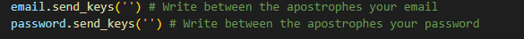

[![LinkedIn][linkedin-shield]][linkedin-url]

<!-- PROJECT LOGO -->
<br />
<div align="center">
    
  </a>

  <h3 align="center">Post Linkedin-LidorLazar</h3>

  <p align="center">
    Welcome to my Project
    <br />
    <a href="https://https://github.com/LidorLazar/"><strong> Linkedin </strong></a>
    <br />
    <br />
    <a href="https://github.com/LidorLazar">Github</a>
    ·
    <a href="https://https://github.com/LidorLazar">Linkedin</a>
    ·
  </p>
</div>

<!-- TABLE OF CONTENTS -->
<details>
  <summary>Table of Contents</summary>
  <ol>
    <li>
      <a href="#about-the-project">About The Project</a>
      <ul>
        <li><a href="#built-with">Built With</a></li>
      </ul>
    </li>
    <li>
      <a href="#getting-started">Getting Started</a>
      <ul>
        <li><a href="#prerequisites">Prerequisites</a></li>
        <li><a href="#installation">Installation</a></li>
      </ul>
    </li>
    <li><a href="#license">License</a></li>
    <li><a href="#contact">Contact</a></li>

  </ol>
</details>

<!-- ABOUT THE PROJECT -->

## About The Project
This is a fisrt version to upload post in Linkedin
I will do it later add opption to send message to comment

For now the program only create new post for you 

## Installation & Run
```bash
Clone the project 
# pass
Activesion the ENV 
#\Linkedin\env\Scripts>activate 
Install the requerments
# pip install -r requirements.txt
Run the program 
# py app.py
```


## Built With
The programs bulid with:
<br>


<!-- CONTRIBUTING -->

# Importent read before run the app
<p>
<h2>
Workin only Win and Chrome!!
</h2>
In line 25-26 you need get yours parameters

<b>If dont get the parameters the program dont work
And wirte in file post.txt what do you want to post !!</b>
</p>

<!-- LICENSE -->

## License

All the credit to Lidor , if you want copy ot use my code ,
Please write credit.


<!-- CONTACT -->

## Contact✍🏻

Name - Lidor Lazar 

Email - Lidorlazar3@gmail.com

Phone - +972526006313

GitHub Link: [https://https://github.com/LidorLazar](https://https://github.com/LidorLazar)

<p align="right">(<a href="#readme-top">back to top</a>)</p>

<!-- ACKNOWLEDGMENTS -->


<!-- MARKDOWN LINKS & IMAGES -->
<!-- https://www.markdownguide.org/basic-syntax/#reference-style-links -->
[license-shield]: https://img.shields.io/github/license/othneildrew/Best-README-Template.svg?style=for-the-badge
[linkedin-shield]: https://img.shields.io/badge/-LinkedIn-black.svg?style=for-the-badge&logo=linkedin&colorB=555
[linkedin-url]: https://www.linkedin.com/in/lidor-lazar

